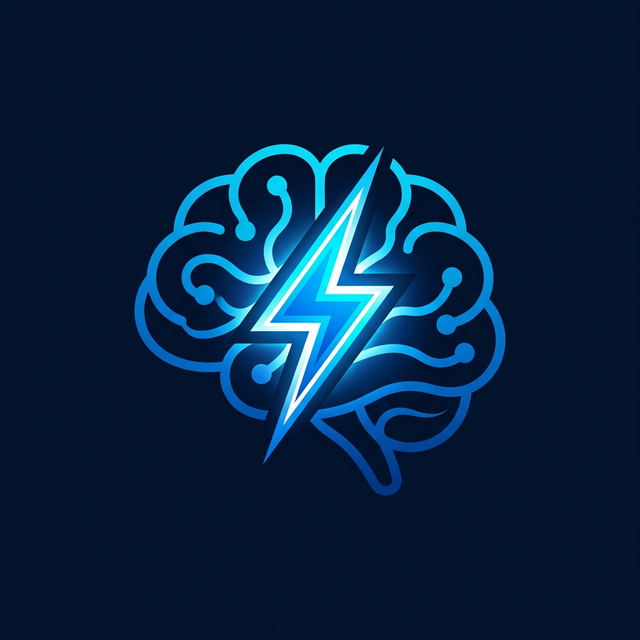

<p align="center">
  
</p>

<h1 align="center">Spark</h1>

<p align="center">
  <strong>The Local-First Intelligent Knowledge Engine</strong>
</p>

<p align="center">
  
  
  
</p>

---

## ⚡ What is Spark?

Spark is a high-performance, local-first knowledge management application designed for speed, privacy, and intelligent discovery. It transforms your raw markdown files into an organized personal brain, allowing you to focus on thinking while Spark handles the organization.

## ✨ Why Choose Spark?

Unlike cloud-based tools that treat your data as a product, Spark treats your data as your own. Everything stays on your machine, yet you get the powerful search and discovery features usually reserved for massive server-side engines.

- **🚀 Ultra-Fast Performance**: Built on Tauri for a native-like experience with minimal resource footprint.
- **🛡️ Privacy by Design**: Your thoughts never leave your local system.
- **🧠 Advanced Discovery**: Don't just find files; find *concepts*.
- **💎 Premium Experience**: A state-of-the-art UI with fluid animations and professional typography.

## 🛠️ Key Features

### 🔍 Search Reinvented
- **Centralized Search Engine**: A dedicated, distraction-free view for your search results.
- **Lexical & Fuzzy Matching**: Find "Architecture" even if you only remember "archit".
- **Contextual Previews**: See what's inside the file before opening it, with intelligent content snippets.
- **Lightning Shortcuts**: `Ctrl + K` or `Ctrl + F` to start searching instantly from anywhere.

### 👓 Visual Excellence
- **Curated Typography**: Using **Inter** for UI clarity and **Outfit** for elegant headings.
- **Code Perfection**: **JetBrains Mono** integrated for high-readability technical content.
- **Fluid Motion**: Powered by Framer Motion for smooth, professional transitions.

### 📂 Seamless Navigation
- **Sidebar Auto-Sync**: The sidebar intelligently follows your navigation, auto-expanding folders to keep you oriented.
- **Local & Remote**: Manage your local vault alongside your GitHub repositories in one unified interface.

## 🚀 Getting Started

### Prerequisites
- [Node.js](https://nodejs.org/) (latest LTS)
- [Rust](https://www.rust-lang.org/) (for Tauri building)
- [Bun](https://bun.sh/) (recommended package manager)

### Installation

1. **Clone the repository**
   ```bash
   git clone https://github.com/youruser/spark.git
   ```

2. **Install dependencies**
   ```bash
   bun install
   ```

3. **Run in development mode**
   ```bash
   bun tauri dev
   ```

## 📜 Recommended IDE Setup

- [VS Code](https://code.visualstudio.com/) + [Tauri Extension](https://marketplace.visualstudio.com/items?itemName=tauri-apps.tauri-vscode) + [rust-analyzer](https://marketplace.visualstudio.com/items?itemName=rust-lang.rust-analyzer)

---

<p align="center">
  Built with ❤️ for those who think deeply.
</p>
